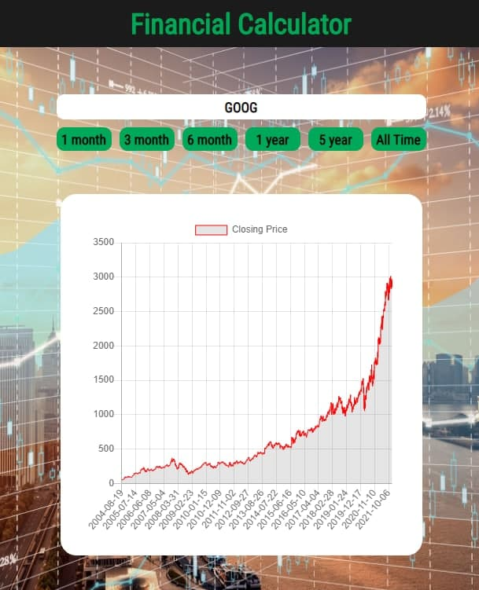

# financial-calculator

## Project setup
```
npm install
```

### Compiles and hot-reloads for development
```
npm run serve
```

### Compiles and minifies for production
```
npm run build
```

### Lints and fixes files
```
npm run lint
```

### Customize configuration
See [Configuration Reference](https://cli.vuejs.org/config/).

### Description
Use this web application to do fundamental analysis on stocks. Enter the required information about the company and the web app will help calculate the statistics that indicates if this stock is worthy of being added to your portfolio based on Fundamental Analysis Principles from a book by Warren Buffett.

Users can enter a ticker and click Submit, the app will

1. Send a get request using the input ticker to Financial Modeling Prep API, and automatically fill in information in the input boxes
2. Send a get request to another of my API (MacroTrend WebScraping API) which will go to MacroTrends website and WebScrapes historic financial data and also autotomatically fills in information after retrieving it

[link to website](https://financial-calculator-wb.herokuapp.com/)


Historic Stock Price can also be searched in another route, which can be navigated by the side bar. With every ticker searched, the application caches the all time historic prices and slices according to the time span requested for. This way, the application does not have to make an API call everytime a different time frame is clicked which will lead to better performance.



### Benefits
Previously, I had an excel sheet that looks similar to this website. However, I would need to manually visit both MacroTrends and Yahoo Finance and manually copy-paste data into the input fields. This task not only takes about 5 minutes per company, but is prone to human errors (such as missing out 1 digit when copying which could cost you a fortune). Therefore, this website not only improves accuracy of data transfer to 100%, but **automates a 5 minute task into a mere 10 seconds**, which is a **30x improvement in speed**.


### Design Decisions
1. Use Vuex store for calculations as there are many input fields and result fields, having a single source of truth would make transfer of data between components simpler
2. Use Vuex store to dispatch asynchronous actions such as fetching from Yahoo Finance API
3. Modularise store into the different purposes that they fulfil, for ease of editing functionalities and for more seamless debugging process
4. Cache stock prices if the ticker remains the same but time period changes for faster responses
